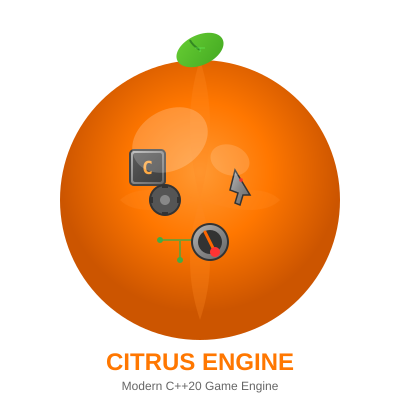

```
    ██████╗██╗████████╗██████╗ ██╗   ██╗███████╗
   ██╔════╝██║╚══██╔══╝██╔══██╗██║   ██║██╔════╝
   ██║     ██║   ██║   ██████╔╝██║   ██║███████╗
   ██║     ██║   ██║   ██╔══██╗██║   ██║╚════██║
   ╚██████╗██║   ██║   ██║  ██║╚██████╔╝███████║
    ╚═════╝╚═╝   ╚═╝   ╚═╝  ╚═╝ ╚═════╝ ╚══════╝
                                                  
   ███████╗███╗   ██╗ ██████╗ ██╗███╗   ██╗███████╗
   ██╔════╝████╗  ██║██╔════╝ ██║████╗  ██║██╔════╝
   █████╗  ██╔██╗ ██║██║  ███╗██║██╔██╗ ██║█████╗  
   ██╔══╝  ██║╚██╗██║██║   ██║██║██║╚██╗██║██╔══╝  
   ███████╗██║ ╚████║╚██████╔╝██║██║ ╚████║███████╗
   ╚══════╝╚═╝  ╚═══╝ ╚═════╝ ╚═╝╚═╝  ╚═══╝╚══════╝
```

<div align="center">



### 🍋 **Fresh, Zesty Game Engine for Modern C++** 🍊

_Get more juice from your code with C++20, ECS architecture, and cross-platform awesomeness!_

[](LICENSE)
[](https://en.cppreference.com/w/cpp/20)
[](#platforms)

[Features](#-core-features) • [Quick Start](#-quick-start) • [Documentation](#-documentation) • [Contributing](#-contributing) • [Community](#-community)

</div>

---

## 🍊 What is Citrus Engine?

**Citrus Engine** is a high-performance, cross-platform game engine that brings the zest back to C++20 game development!
Like a perfectly ripe orange, it's:

- 🍋 **Fresh & Modern** - Built from scratch with C++20 modules, concepts, and coroutines (no legacy baggage!)
- 🍊 **Perfectly Balanced** - Entity Component System architecture for juicy performance gains
- 🎨 **Packed with Vitamins** - Rich rendering pipeline, multi-threading, and data-oriented design
- 🌐 **Cross-Platform Goodness** - Native Windows/Linux and WebAssembly with identical features
- 💚 **Open & Sweet** - Zero license fees, no vendor lock-in, clean architecture with zero technical debt

Whether you're crafting a colony simulation, real-time strategy game, or any performance-critical application, Citrus
Engine gives your project that fresh C++20 boost it needs!

---

## 🌟 Core Features

### ⚡ Key Features

| Feature                         | Description                                                                                                         |
|---------------------------------|---------------------------------------------------------------------------------------------------------------------|
| 🎯 **Modern C++20**             | Leverage modules, concepts, coroutines, and ranges for clean, expressive code                                       |
| ⚡ **ECS Architecture**         | Data-oriented Entity Component System using [Flecs](https://github.com/SanderMertens/flecs) for maximum performance |
| 🎨 **Cross-Platform Rendering** | OpenGL ES 2.0 / WebGL abstraction for consistent visuals everywhere                                                 |
| 🚀 **Multi-Threading**          | Job system with frame pipelining for parallel execution                                                             |
| 🌐 **WebAssembly First**        | Deploy to browsers with full feature parity to native builds                                                        |
| 📦 **vcpkg Integration**        | Easy dependency management with vcpkg overlay ports                                                                 |
| 🎮 **ImGui Integration**        | Built-in immediate mode GUI for development tools                                                                   |
| 🗺️ **Tilemap System**           | Efficient 2D tile-based rendering for strategy and simulation games                                                 |
| 🎯 **Zero License Fees**        | Open source with no royalties or subscriptions                                                                      |

---

## 🚀 Quick Start

### 📋 Prerequisites

Before you begin, ensure you have the required tools for your platform:

#### 🪟 Windows (Native Build)

- **Visual Studio 2022** (17.0 or later) with C++20 support, OR standalone Clang-18+
- **CMake 3.28+**
- **vcpkg** (in parent directory of ENV)
- **Git** for version control
- **Ninja** build tool (recommended; CMake will use it if available)

#### 🐧 Linux (Native Build)

```bash
# Install system dependencies (all in one command)
sudo apt-get update && sudo apt-get install -y \
  build-essential cmake ninja-build pkg-config clang-18 \
  libx11-dev libxrandr-dev libxinerama-dev libxcursor-dev \
  libxi-dev libgl1-mesa-dev libglu1-mesa-dev
```

#### 🌐 WebAssembly / Emscripten (WASM Build)

```bash
# Install Emscripten SDK (one time)
cd /opt  # or preferred location
git clone https://github.com/emscripten-core/emsdk.git
cd emsdk
./emsdk install latest
./emsdk activate latest

# Verify installation
emcc --version  # Should show version 3.1.40 or later
```

#### macOS

- **Xcode Command Line Tools** (`xcode-select --install`)
- **CMake 3.28+** (via Homebrew: `brew install cmake`)
- **Clang-18+** (via Homebrew: `brew install clang-tools`)
- **Ninja** (via Homebrew: `brew install ninja`)
- **vcpkg** (in parent directory of citrus-engine)

### ⚙️ Environment Setup

#### 1. Clone and Bootstrap vcpkg

```bash
cd /path/to/vcpkg
git clone https://github.com/microsoft/vcpkg.git
cd vcpkg
./bootstrap-vcpkg.sh      # Linux/macOS
vcpkg\bootstrap-vcpkg.bat # Windows
```

#### 2. Set Environment Variables

**Linux/macOS Native:**

```bash
export VCPKG_ROOT=/path/to/vcpkg
export CC=clang-18
export CXX=clang++-18
```

**Linux/macOS Web (Emscripten):**

```bash
source /path/to/emsdk/emsdk_env.sh  # Sets CC/CXX automatically
export VCPKG_ROOT=/path/to/vcpkg
```

**Windows:**

```cmd
set VCPKG_ROOT=\path\to\vcpkg
```

If using MSVC on Windows, also note: Visual Studio Developer Command Prompt initializes the environment automatically.

### 🏗️ Building Citrus Engine

#### 🪟 Windows Native Build (MSVC)

```bash
# From Visual Studio Developer Command Prompt:
cd citrus-engine
cmake --preset native -DVCPKG_TARGET_TRIPLET=x64-windows
cmake --build --preset native-debug --parallel %NUMBER_OF_PROCESSORS%

# Or with Clang:
cmake --preset native -DVCPKG_TARGET_TRIPLET=x64-windows
cmake --build --preset native-debug
```

#### 🐧 Linux Native Build

```bash
cd citrus-engine
export CC=clang-18 CXX=clang++-18 VCPKG_ROOT=/path/to/vcpkg

cmake --preset native -DVCPKG_TARGET_TRIPLET=x64-linux
cmake --build --preset native-debug --parallel $(nproc)
```

#### 🍎 macOS Native Build

```bash
cd citrus-engine
export VCPKG_ROOT=/path/to/vcpkg

cmake --preset native -DVCPKG_TARGET_TRIPLET=x64-osx
cmake --build --preset native-debug --parallel $(sysctl -n hw.ncpu)
```

#### 🌐 WebAssembly Build (Emscripten)

```bash
source /path/to/emsdk/emsdk_env.sh
export VCPKG_ROOT=/path/to/vcpkg

cd citrus-engine
cmake --preset native -DVCPKG_TARGET_TRIPLET=wasm32-emscripten
cmake --build --preset native-debug
```

**First build will take longer** as vcpkg builds all dependencies.

#### 📋 Platform Triplets

| Platform       | Triplet           | Command                                                          |
|----------------|-------------------|------------------------------------------------------------------|
| Windows Native | x64-windows       | `cmake --preset native -DVCPKG_TARGET_TRIPLET=x64-windows`       |
| Linux Native   | x64-linux         | `cmake --preset native -DVCPKG_TARGET_TRIPLET=x64-linux`         |
| macOS Native   | x64-osx           | `cmake --preset native -DVCPKG_TARGET_TRIPLET=x64-osx`           |
| WebAssembly    | wasm32-emscripten | `cmake --preset native -DVCPKG_TARGET_TRIPLET=wasm32-emscripten` |

**Important**: Only use native or test targets, `cli-*` are for CLI only. Always specify `-DVCPKG_TARGET_TRIPLET` on the
command line.

### 🔨 Common Build Workflows

#### Basic Build

```bash
cmake --build --preset native-debug
```

This builds with debug symbols for development.

#### Parallel Build (Faster)

```bash
# Linux/macOS
cmake --build --preset native-debug --parallel $(nproc)

# Windows
cmake --build --preset cative-debug --parallel %NUMBER_OF_PROCESSORS%
```

#### Release Build

```bash
cmake --build --preset native-release
```

Use release builds for performance testing and distribution.

#### Rebuild from Scratch

```bash
rm -rf build/native  # Remove build directory
cmake --preset native -DVCPKG_TARGET_TRIPLET=<triplet>
cmake --build --preset native-debug
```

#### Rebuild Tests Only

```bash
cmake --build --preset native-test-debug --target <test-name>
```

#### Run Specific Tests

```bash
ctest --preset native-test-debug -R <test-pattern>
```

For example: `ctest --preset native-test-debug -R "Transform"` runs all tests matching "Transform".

### 🔍 Linting & Formatting

Format and lint code using the provided scripts:

```bash
# Unix/Linux/macOS
./scripts/format-code.sh    # Format code
./scripts/lint-code.sh      # Lint code

# Windows (PowerShell)
.\scripts\format-code.ps1   # Format code (defers to make if Git Bash available)
.\scripts\lint-code.ps1     # Lint code (defers to make if Git Bash available)

# All platforms (via make)
make format                 # Format all code
make lint                   # Lint all code
```

**File Extensions Checked:** `.c`, `.cpp`, `.h`, `.hpp`, `.cppm`

**Linting Note:** `clang-tidy` requires all build types (`debug`, `reldebuginfo`, `release`) to be built first.
The generated `compile_commands.json` includes references to all build configurations, even though only one preset
is active at a time. To lint successfully:

```bash
cmake --preset native -DVCPKG_TARGET_TRIPLET=<triplet>
cmake --build --preset native-debug
cmake --build --preset native-reldebuginfo
cmake --build --preset native-release
./scripts/lint-code.sh
```

### 🐛 Common Build Issues

| Problem                                 | Solution                                                              |
|-----------------------------------------|-----------------------------------------------------------------------|
| "Could not find CMake version 3.28"     | Install CMake 3.28+: https://cmake.org/download/                      |
| "fatal error: 'flecs.h' file not found" | Reconfigure: `cmake --preset native -DVCPKG_TARGET_TRIPLET=<triplet>` |
| "error: use of undeclared identifier"   | Check module preambles for missing `#include <cstdint>`               |
| "cannot find compiler (Linux)"          | Set `export CC=clang-18 CXX=clang++-18` and try again                 |
| "ModuleNotFound" errors (CMake 3.31+)   | Reconfigure with `CMAKE_CXX_SCAN_FOR_MODULES=OFF`                     |
| Build hangs on Windows                  | Kill cmake process and use `/J` flag for shorter paths if needed      |
| Tests pass locally but fail in CI       | Ensure triplet, compiler, and CMake version match CI workflow         |

### 💻 Compiler Requirements

| Platform | Compiler   | Min Version | Notes                                   |
|----------|------------|-------------|-----------------------------------------|
| Windows  | MSVC       | 2022        | Or MinGW-w64 GCC 10+                    |
| Linux    | Clang      | 18+         | GCC has incomplete C++20 module support |
| macOS    | Clang      | 10+         | Via Xcode Command Line Tools            |
| Web      | Emscripten | 3.1.40+     | Latest from emsdk                       |

### 📦 Installing via vcpkg (For Use in Other Projects)

```cmake
find_package(citrus-engine CONFIG REQUIRED)
target_link_libraries(your-target PRIVATE citrus-engine::engine-core)
```

---

## 🎮 Using Citrus Engine in Your Project

Transform your game development with the power of citrus! Here's how to integrate Citrus Engine into your project.

### 📋 Project Setup

#### 1. Create Your vcpkg.json

```json
{
  "name": "your-awesome-game",
  "version": "1.0.0",
  "dependencies": [
    "citrus-engine"
  ],
  "overrides": [
    {
      "name": "spdlog",
      "version": "1.11.0"
    },
    {
      "name": "fmt",
      "version": "9.0.0"
    }
  ]
}
```

> 💡 **Note**: The `overrides` block ensures compatible versions of logging libraries are used.

#### 2. Set up Your CMakeLists.txt

```cmake
cmake_minimum_required(VERSION 3.20)
project(your-awesome-game)

# Find Citrus Engine 🍊
find_package(citrus-engine CONFIG REQUIRED)

# Create your executable
add_executable(your-game
    src/main.cpp
    # ... your source files
)

# Link to the engine 🔗
target_link_libraries(your-game PRIVATE
    citrus-engine::engine-core
)

setup_asset_preload(your-game ${CMAKE_CURRENT_SOURCE_DIR}/assets)

# WebAssembly configuration (optional)
if (EMSCRIPTEN)
    set(CMAKE_EXECUTABLE_SUFFIX ".html")
    target_link_options(your-game PRIVATE
        -sWASM=1
        -sFORCE_FILESYSTEM=1
        -sINITIAL_MEMORY=67108864    # 64MB
        -sMAXIMUM_MEMORY=134217728   # 128MB
    )
endif ()
```

#### 3. Configure CMake Presets

Create `CMakePresets.json`:

```json
{
  "version": 8,
  "cmakeMinimumRequired": {
    "major": 3,
    "minor": 20,
    "patch": 0
  },
  "configurePresets": [
    {
      "name": "base",
      "hidden": true,
      "generator": "Ninja",
      "binaryDir": "${sourceDir}/build/${presetName}",
      "toolchainFile": "$env{VCPKG_ROOT}/scripts/buildsystems/vcpkg.cmake",
      "cacheVariables": {
        "CMAKE_CXX_STANDARD": "20"
      }
    },
    {
      "name": "native",
      "displayName": "Native Build",
      "inherits": "base",
      "cacheVariables": {
        "VCPKG_TARGET_TRIPLET": "x64-windows"
      }
    },
    {
      "name": "wasm",
      "displayName": "WASM Build",
      "inherits": "base",
      "cacheVariables": {
        "CMAKE_BUILD_TYPE": "Release",
        "VCPKG_CHAINLOAD_TOOLCHAIN_FILE": "$env{EMSDK}/upstream/emscripten/cmake/Modules/Platform/Emscripten.cmake",
        "VCPKG_TARGET_TRIPLET": "wasm32-emscripten"
      }
    }
  ]
}
```

### 💻 Your First Game with Citrus Engine

```cpp
import engine.platform;
import engine.rendering;
import engine.ecs;

int main() {
    // Initialize the engine platform
    auto platform = engine::Platform::Create();
    
    // Create rendering context
    auto renderer = engine::Renderer::Create();
    
    // Set up ECS world
    auto world = engine::ECS::CreateWorld();
    
    // Your game logic here...
    
    return 0;
}
```

---

## ⚠️ Important: Shader Vertex Layout Requirements

When writing custom shaders for Citrus Engine, you **must** match the engine's vertex attribute layout. Mismatched
layouts cause **silent rendering failures** (no errors, nothing renders).

### 📋 Required Vertex Attribute Locations

The engine uploads these 4 attributes to the GPU in this exact order:

| Location | Type | GLSL Declaration                          | C++ Field    |
|----------|------|-------------------------------------------|--------------|
| **0**    | vec3 | `layout(location = 0) in vec3 aPos;`      | `position`   |
| **1**    | vec3 | `layout(location = 1) in vec3 aNormal;`   | `normal`     |
| **2**    | vec2 | `layout(location = 2) in vec2 aTexCoord;` | `tex_coords` |
| **3**    | vec4 | `layout(location = 3) in vec4 aColor;`    | `color`      |

### ✅ Correct Shader Example

```glsl
#version 300 es

// CORRECT: Use exact layout locations
layout(location = 0) in vec3 aPos;
layout(location = 1) in vec3 aNormal;
layout(location = 2) in vec2 aTexCoord;
layout(location = 3) in vec4 aColor;

uniform mat4 u_MVP;
out vec4 vColor;

void main() {
    vColor = aColor;
    gl_Position = u_MVP * vec4(aPos, 1.0);
}
```

### ⚠️ Using Subset of Attributes

You can use fewer attributes, **but location numbers must stay the same**:

```glsl
#version 300 es

// CORRECT: Skip unused attributes but keep location numbers
layout(location = 0) in vec3 aPos;
// Skip location 1 (normal) - not used
// Skip location 2 (texcoord) - not used
layout(location = 3) in vec4 aColor;// Must be location 3, not 1!

uniform mat4 u_MVP;
out vec4 vColor;

void main() {
    vColor = aColor;
    gl_Position = u_MVP * vec4(aPos, 1.0);
}
```

### ❌ Common Mistakes

**WRONG - Renumbering locations:**

```glsl
layout(location = 0) in vec3 aPos;
layout(location = 1) in vec4 aColor;// WRONG! Color is location 3
```

**WRONG - Wrong types:**

```glsl
layout(location = 3) in vec3 aColor;// WRONG! Color is vec4, not vec3
```

### 📚 Reference Shaders

See working examples in `examples/assets/shaders/`:

- `colored_2d.vert` - Simple 2D colored vertex shader
- Additional shader examples (coming soon)

### 🔮 Future Improvement

The Citrus Engine team is planning a shader-driven vertex layout system that will automatically adapt to any shader
layout locations. This will eliminate silent failures and make shader development more flexible. Track progress
in [issue #TBD].

### 🏗️ Building Your Project

```bash
# Native build
cmake --preset native
cmake --build --preset native-release
./build/native/your-game

# WebAssembly build
cmake --preset wasm
cmake --build --preset wasm-release
cd build/wasm && python -m http.server 8080
```

---

## 🎨 Assets & Resources

Citrus Engine supports a rich variety of asset types for building beautiful games.

### 📁 Asset Directory Structure

```
assets/
├── shaders/          # 🎨 GLSL shader files (.vert, .frag)
├── textures/         # 🖼️ Image files (.png, .jpg, .webp)
├── models/           # 🗿 3D model files (.obj, .gltf)
├── audio/            # 🔊 Audio files (.wav, .ogg)
└── fonts/            # 📝 Font files (.ttf, .otf)
```

### 🌐 Platform-Specific Asset Loading

#### Native Builds

- Assets loaded directly from filesystem
- Supports hot-reloading during development
- No build-time processing required

#### WebAssembly Builds

- Assets preloaded into WASM virtual filesystem
- Automatic detection from `assets/` directory
- Available at `/assets/` path in runtime

### 📦 Loading Assets in Code

```cpp
import engine.rendering;

// Load texture 🖼️
auto texture_id = texture_manager.LoadTexture("assets/textures/citrus_sprite.png");

// Load shader pair 🎨
auto shader_id = shader_manager.LoadShader(
    "assets/shaders/juicy.vert", 
    "assets/shaders/juicy.frag"
);
```

---

## 🏗️ Architecture & Design

### 🎯 Engine Modules

Citrus Engine follows a clean, modular architecture:

```
🍊 Foundation Layer
├── engine.platform      # Cross-platform abstractions
├── engine.ecs           # Entity Component System
├── engine.rendering     # OpenGL/WebGL pipeline
└── engine.scene         # Transform hierarchies

🍋 Future Modules (Planned)
├── engine.physics       # 2D/3D physics simulation
├── engine.scripting     # Multi-language scripting
├── engine.animation     # Animation systems
├── engine.networking    # Multiplayer support
└── engine.profiling     # Performance tools
```

### 💡 Design Principles

| Principle                     | Description                                           |
|-------------------------------|-------------------------------------------------------|
| 🎯 **Data-Oriented**          | Cache-friendly memory layouts for maximum performance |
| 🌐 **Cross-Platform First**   | Identical behavior on all target platforms            |
| 🔒 **Thread-Safe**            | Lock-free architecture where possible                 |
| 🚀 **Modern C++20**           | Concepts, modules, and coroutines throughout          |
| 🍊 **Zero-Cost Abstractions** | Performance without compromise                        |

### 📊 Project Structure

```
citrus-engine/
├── src/                    # 🍊 Source code
│   └── engine/            # Core engine modules
│       ├── platform/      # Platform abstraction
│       ├── ecs/           # Entity Component System
│       ├── rendering/     # Rendering pipeline
│       └── scene/         # Scene management
├── assets/                # 🎨 Game assets
├── plan/                  # 📋 Design documentation
├── docs/                  # 📚 Additional documentation
├── tests/                 # 🧪 Unit tests
├── cmake/                 # 🔧 CMake modules
└── ports/                 # 📦 vcpkg port definitions
```

---

## 🧪 Development & Testing

### 🔧 Development Workflow

```bash
# Quick rebuild and test
cmake --build --preset cli-native-debug
ctest --preset cli-native-test-debug
```

### 🧪 Running Tests

```bash
# Run tests
ctest --preset native-test-debug

# Run specific test pattern
ctest --preset native-test-debug -R "Transform"
```

---

## 🔧 Troubleshooting

Common issues and solutions:

### 🛠️ Common Build Issues

<details>
<summary><b>❌ CMake can't find vcpkg</b></summary>

```bash
# Solution: Ensure VCPKG_ROOT environment variable is set
echo %VCPKG_ROOT%  # Should show C:\vcpkg or your installation path

# Set it if missing:
set VCPKG_ROOT=C:\vcpkg
```

</details>

<details>
<summary><b>❌ Emscripten build fails</b></summary>

```bash
# Solution: Verify EMSDK environment variable
echo %EMSDK%       # Should show your emsdk installation path
emsdk list         # Verify installation

# Ensure latest version is activated
emsdk activate latest
```

</details>

<details>
<summary><b>❌ Missing OpenGL context</b></summary>

```bash
# Native: Update graphics drivers and ensure OpenGL 3.3+ support
# WASM: Ensure WebGL 2.0 support in browser (use Chrome/Firefox/Edge)
```

</details>

<details>
<summary><b>❌ Asset loading failures</b></summary>

```bash
# Verify asset paths are relative to executable location
# Check that assets/ directory exists in build output
# For WASM: Ensure setup_asset_preload() is called in CMakeLists.txt
```

</details>

### ⚡ Performance Issues

**🐌 Low FPS on Windows**

- ✅ Check Debug vs Release build configuration
- ✅ Verify V-Sync settings
- ✅ Profile with Visual Studio Diagnostic Tools

**🐌 Slow WASM Performance**

- ✅ Verify Release build with optimizations enabled
- ✅ Check browser WebGL implementation (prefer Chrome/Firefox)
- ✅ Monitor browser console for warnings
- ✅ Reduce asset sizes for faster download

### 🎯 Build Configuration Guide

```bash
# 🐛 Debug: Slower, full debugging symbols
cmake --build --preset native-debug

# 🚀 Release: Optimized, minimal debug info
cmake --build --preset native-release

# 🔍 Profile: Build release, then run with profiler attached
cmake --build --preset native-release
```

---

## 🤝 Contributing

We'd love your help making Citrus Engine even more refreshing! 🍊

See **[CONTRIBUTING.md](CONTRIBUTING.md)** for the full guide: development setup, PR process, testing requirements, commit conventions, and code style references.

---

## 🌟 Community & Support

### 💬 Getting Help

- 📚 **Documentation**: Check our comprehensive docs in the `/docs` folder
- 💡 **Issues**: Open an issue on GitHub for bugs or feature requests
- 🤝 **Discussions**: Join conversations in GitHub Discussions

### 🙏 Acknowledgments

Citrus Engine is powered by amazing open-source libraries:

- 🎯 **[Flecs](https://github.com/SanderMertens/flecs)** - High-performance ECS
- 🎨 **[ImGui](https://github.com/ocornut/imgui)** - Immediate mode GUI
- 🌐 **[GLFW](https://www.glfw.org/)** - Cross-platform windowing
- 📐 **[GLM](https://github.com/g-truc/glm)** - Mathematics library
- 📦 **[vcpkg](https://vcpkg.io/)** - Package management

### 🎖️ Contributors

Thank you to all our contributors who help make Citrus Engine better!

---

## 📚 Resources & Documentation

### 🔗 Essential Links

| Resource                                                       | Description                  |
|----------------------------------------------------------------|------------------------------|
| 📖 **[C++20 Reference](https://en.cppreference.com/w/cpp/20)** | Modern C++ language features |
| 🎨 **[OpenGL ES 2.0](https://www.khronos.org/opengles/)**      | Graphics API specification   |
| 🌐 **[WebGL 2.0](https://www.khronos.org/webgl/)**             | Web graphics API             |
| ⚙️ **[Emscripten Docs](https://emscripten.org/docs/)**         | WebAssembly compilation      |
| 📦 **[vcpkg](https://vcpkg.io/)**                              | C++ package manager          |
| 🎯 **[Flecs Documentation](https://www.flecs.dev/flecs/)**     | ECS framework guide          |

### 📁 Additional Documentation

- 📋 **[Code Style Guide](CODE_STYLE_GUIDE.md)** — Naming, formatting, design principles index
- 🤝 **[Contributing Guide](CONTRIBUTING.md)** — How to contribute to the project
- 🧪 **[Testing Guide](TESTING.md)** — Test structure and priorities
- 🎨 **[UI Development Bible](UI_DEVELOPMENT_BIBLE.md)** — Batch rendering UI patterns
- 🗺️ **[Tilemap System](docs/tilemap-system.md)** — 2D tile rendering documentation
- 🏗️ **[Architecture](plan/ARCH_ENGINE_CORE_v1.md)** — Engine architecture overview

---

## 📜 License

[Specify your license here]

---

---

<div align="center">

```
        🍊 Citrus Engine 🍋
        
     Built with Modern C++20
     
   ════════════════════════════════════════
```

**Citrus Engine** - _High-Performance Game Development with Modern C++20_

---

**Engine Version**: 🍊 Citrus MVP v1.0  
**Last Updated**: October 28, 2024  
**Target Platforms**: 🪟 Windows x64 | 🐧 Linux x64 | 🌐 WebAssembly

**Made with 🍋 by the Citrus Engine Team**

[⭐ Star us on GitHub](https://github.com/adam4813/citrus-engine) • [🍴 Fork](https://github.com/adam4813/citrus-engine/fork) • [🐛 Report Bug](https://github.com/adam4813/citrus-engine/issues) • [💡 Request Feature](https://github.com/adam4813/citrus-engine/issues)

</div>
