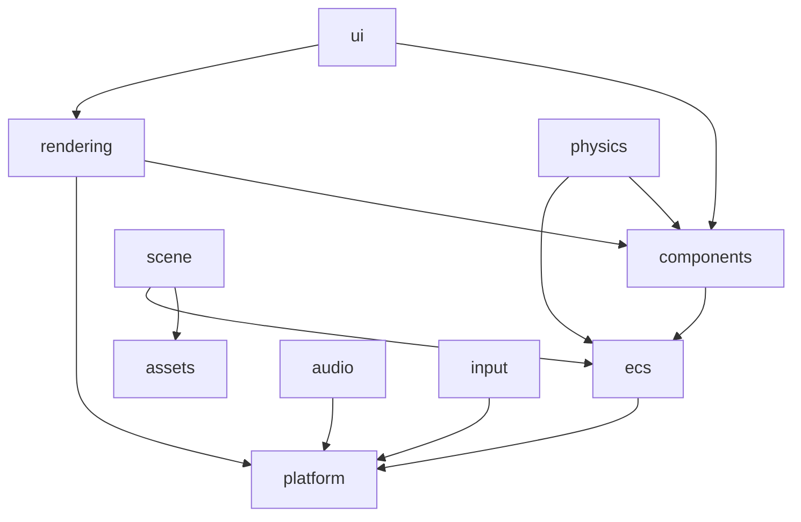
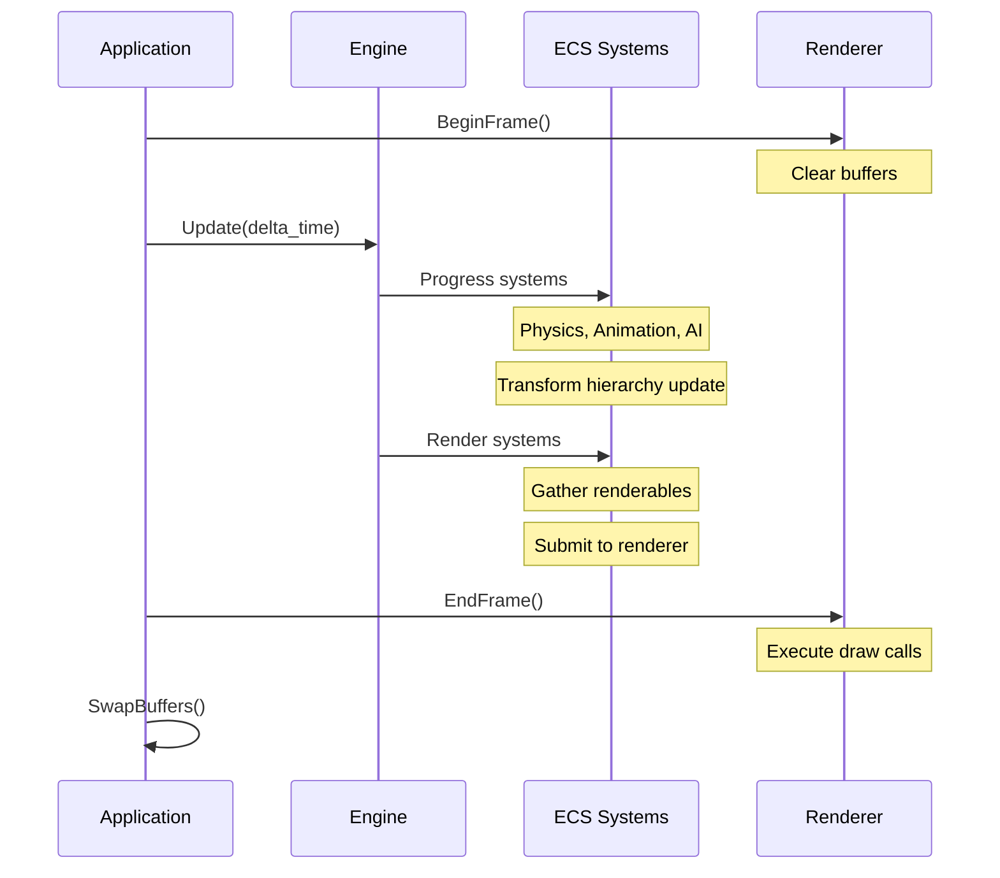
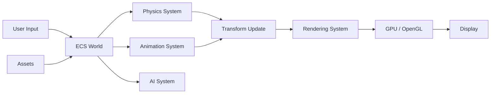

# Architecture Overview

This document provides a high-level overview of Citrus Engine's architecture, designed to help you understand how the different systems work together.

## Core Principles

Citrus Engine is built on these foundational principles:

- **Data-Oriented Design**: Cache-friendly memory layouts for maximum performance
- **Entity-Component-System (ECS)**: Powered by [Flecs](https://www.flecs.dev/flecs/) for flexible entity management
- **Modern C++20**: Modules, concepts, and modern language features throughout
- **Cross-Platform**: Identical behavior on Windows, Linux, and WebAssembly

## Module Map

The engine is organized into modular subsystems:

```
engine
├── platform          # Cross-platform abstractions (window, filesystem, timing)
├── ecs               # Entity-Component-System (Flecs integration)
├── rendering         # OpenGL/WebGL rendering pipeline
├── scene             # Scene management and serialization
├── components        # Core ECS components (Transform, Camera, etc.)
├── assets            # Asset loading and management
├── input             # Keyboard, mouse, and gamepad input
├── ui                # Batch-rendered UI system
├── audio             # Audio playback (miniaudio backend)
├── physics           # Physics simulation (Jolt, Bullet3, PhysX backends)
├── animation         # Animation system and state machines
├── data              # Data table system for game data
├── graph             # Node graph evaluation
├── ai                # Behavior trees and blackboard
└── scripting         # Scripting support (future)
```

### Module Dependencies



## Engine Initialization

The engine initialization follows this sequence:

```cpp
engine::Engine eng;

// 1. Initialize platform (window, OpenGL context)
eng.Init(width, height);

// 2. Subsystems are now available:
//    - eng.ecs (ECS world)
//    - eng.renderer (rendering system)
//    - eng.window (GLFW window)

// 3. Set up your scene (entities, components)
auto camera = eng.ecs.CreateEntity("Camera");
camera.set<engine::components::Camera>({...});

// 4. Main loop
while (!glfwWindowShouldClose(eng.window)) {
    eng.renderer->BeginFrame();
    eng.Update(delta_time);
    eng.renderer->EndFrame();
    glfwSwapBuffers(eng.window);
}

// 5. Shutdown
eng.Shutdown();
```

## Game Loop Flow

Each frame follows this execution order:



### Update Phases

The ECS world processes systems in distinct phases:

1. **Simulation** (phase: `OnUpdate`)
   - Physics simulation
   - AI behavior trees
   - Animation playback
   - User game logic

2. **Post-Simulation** (phase: `PostUpdate`)
   - Transform hierarchy propagation
   - Camera matrix updates

3. **Pre-Render** (phase: `PreStore`)
   - Collect renderables
   - Frustum culling
   - Submit draw commands

## Entity-Component-System (ECS)

### ECS Fundamentals

Citrus Engine uses **Flecs** for its ECS implementation:

- **Entities**: Unique identifiers (`flecs::entity`)
- **Components**: Data structs attached to entities
- **Systems**: Functions that process entities with specific components
- **Queries**: Efficient iteration over entities matching a pattern

### Creating Entities

```cpp
// Create entity with name
auto entity = eng.ecs.CreateEntity("Player");

// Add components
entity.set<engine::components::Transform>({{0.0f, 0.0f, 0.0f}});
entity.set<engine::components::Velocity>({{1.0f, 0.0f, 0.0f}});

// Tag components
entity.add<engine::physics::RigidBody>();

// Remove component
entity.remove<engine::components::Velocity>();

// Destroy entity
entity.destruct();
```

### Component Examples

Common engine components:

```cpp
// Transform - position, rotation, scale
struct Transform {
    glm::vec3 position{0.0f};
    glm::vec3 rotation{0.0f};  // Euler angles
    glm::vec3 scale{1.0f};
};

// Camera - view and projection
struct Camera {
    glm::vec3 target{0.0f, 0.0f, 0.0f};
    glm::vec3 up{0.0f, 1.0f, 0.0f};
    float fov{60.0f};
    float aspect_ratio{16.0f / 9.0f};
    float near_plane{0.1f};
    float far_plane{100.0f};
};

// Velocity - linear and angular
struct Velocity {
    glm::vec3 linear{0.0f};
    glm::vec3 angular{0.0f};
};
```

### Entity Hierarchies

Flecs supports parent-child relationships:

```cpp
// Create parent entity
auto parent = eng.ecs.CreateEntity("Parent");
parent.set<engine::components::Transform>({{0.0f, 0.0f, 0.0f}});

// Create child entity
auto child = eng.ecs.CreateEntity("Child");
child.child_of(parent);
child.set<engine::components::Transform>({{1.0f, 0.0f, 0.0f}});

// Child's world position is parent + local (1.0, 0.0, 0.0)
```

## Rendering Pipeline

### Rendering Flow

```
1. Application calls BeginFrame()
   ↓
2. Clear color and depth buffers
   ↓
3. Application calls Update()
   ↓
4. ECS systems run
   - Physics updates positions
   - Animation updates transforms
   ↓
5. Transform hierarchy system propagates matrices
   ↓
6. Camera system updates view/projection matrices
   ↓
7. Rendering systems collect renderables
   - Query entities with Transform + Renderable
   - Submit meshes, shaders, materials to renderer
   ↓
8. Application calls EndFrame()
   ↓
9. Renderer executes draw calls
   - Set shader uniforms (MVP matrix, textures)
   - Bind VAO and draw elements
   ↓
10. Application swaps buffers
```

### Render Components

To render an entity, attach rendering components:

```cpp
// Create a mesh (via MeshManager)
auto mesh_id = eng.renderer->GetMeshManager().CreateMesh(mesh_info);

// Create a shader (via ShaderManager)
auto shader_id = eng.renderer->GetShaderManager().LoadShader(
    "my_shader", "shaders/vert.glsl", "shaders/frag.glsl"
);

// Attach to entity
entity.set<engine::rendering::MeshComponent>({mesh_id});
entity.set<engine::rendering::ShaderComponent>({shader_id});
```

## Scene System

### Scene Concept

A **Scene** is a container for entities and assets:

- Each scene has its own set of entities
- Scenes can be loaded/unloaded
- Scenes can be saved/loaded from JSON files
- Only one scene is "active" at a time

### Scene Lifecycle

```cpp
// Get the scene manager
auto& scene_mgr = engine::scene::GetSceneManager();

// Create a new scene
auto scene_id = scene_mgr.CreateScene("Level1");
auto& scene = scene_mgr.GetScene(scene_id);

// Populate the scene
auto entity = scene.CreateEntity("Enemy");
entity.set<engine::components::Transform>({{5.0f, 0.0f, 0.0f}});

// Activate the scene
scene_mgr.SetActiveScene(scene_id);

// Save to file
engine::scene::SceneSerializer::SaveToFile(scene, "scenes/level1.scene.json");

// Load from file
auto loaded_scene = scene_mgr.CreateScene("Level1Loaded");
engine::scene::SceneSerializer::LoadFromFile(loaded_scene, "scenes/level1.scene.json");

// Destroy scene
scene_mgr.DestroyScene(scene_id);
```

## Asset Management

### Asset System

Assets (shaders, textures, audio clips) are managed via the **asset system**:

1. **Created** - Asset metadata exists (paths, names)
2. **Initialized** - Resource slot allocated (e.g., shader ID)
3. **Loaded** - Resource fully loaded and ready to use

### Loading Assets

```cpp
// Shader
auto shader_id = eng.renderer->GetShaderManager().LoadShader(
    "colored_3d", "shaders/basic.vert", "shaders/basic.frag"
);

// Texture
auto texture_id = eng.renderer->GetTextureManager().LoadTexture(
    "textures/player.png"
);

// Audio clip
auto clip_id = engine::audio::AudioSystem::Get().LoadClip("audio/jump.wav");
```

See **[Asset System](asset-system.md)** for detailed information.

## Input Handling

Input is accessed via the `engine::input::Input` namespace:

```cpp
// Keyboard
if (engine::input::Input::IsKeyPressed(engine::input::KeyCode::W)) {
    // Move forward
}

// Mouse
auto [x, y] = engine::input::Input::GetMousePosition();
if (engine::input::Input::IsMouseButtonPressed(engine::input::MouseButton::LEFT)) {
    // Handle click at (x, y)
}

// Gamepad (future)
```

## Data Flow Summary



## Thread Safety

Current implementation is **single-threaded**:

- All ECS systems run on the main thread
- Rendering happens on the main thread
- Future work will introduce job system for parallelism

## Memory Management

- **Entities**: Managed by Flecs ECS (archetype-based storage)
- **Assets**: Managed by resource managers (ref-counted where applicable)
- **Rendering**: GPU resources (VAO, VBO, textures) owned by managers
- **User code**: Use smart pointers (`std::unique_ptr`, `std::shared_ptr`)

## Extension Points

To add new systems to the engine:

1. **Define components** in a new module (e.g., `engine.custom`)
2. **Register systems** with the ECS world
3. **Use existing APIs** for rendering, input, audio, etc.
4. **Follow ECS patterns** for data-oriented design

Example:

```cpp
// Define component
export namespace engine::custom {
struct HealthComponent {
    float current_health{100.0f};
    float max_health{100.0f};
};
}

// Register system
eng.ecs.GetWorld().system<engine::custom::HealthComponent>()
    .each([](flecs::entity e, engine::custom::HealthComponent& health) {
        if (health.current_health <= 0.0f) {
            e.destruct();  // Destroy entity when health reaches zero
        }
    });
```

## Best Practices

1. **Use ECS patterns**: Keep components as data, logic in systems
2. **Avoid singletons**: Use ECS singleton components instead
3. **Prefer composition**: Combine small components over large monolithic ones
4. **Cache queries**: Don't create queries every frame
5. **Profile regularly**: Use ECS observer patterns for event-driven logic

## Further Reading

- **[Getting Started](getting-started.md)** - Set up your first project
- **[Physics API](physics.md)** - Physics simulation details
- **[Audio API](audio.md)** - Audio system usage
- **[Scene Management](scenes.md)** - Advanced scene workflows
- **[API Reference](api/index.md)** - Complete API documentation
