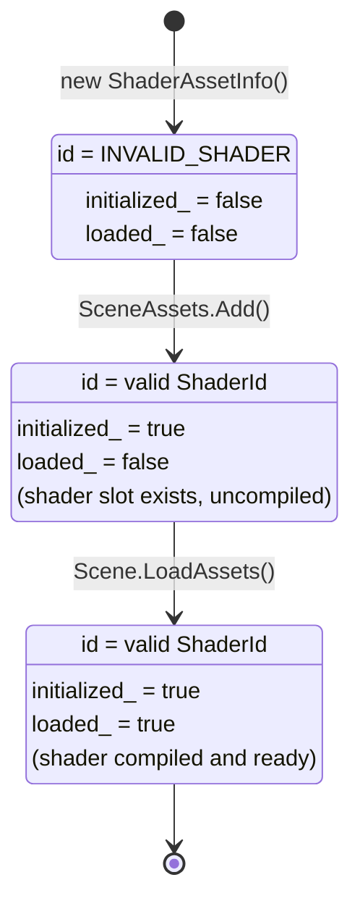
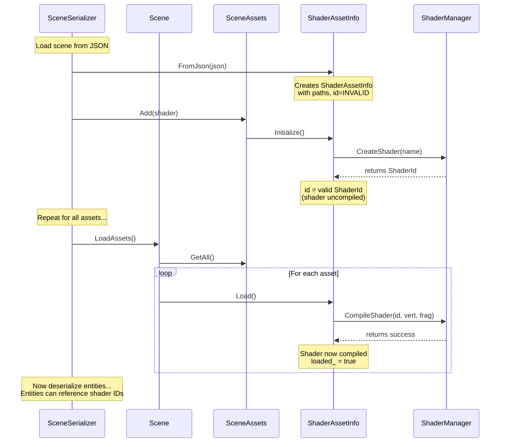

# Asset System

The Citrus Engine asset system manages scene resources like shaders, textures, and materials. It uses a **two-phase
factory pattern** that separates resource allocation from loading, enabling deferred compilation and lazy loading.

## Key Concepts

### Asset Types

Assets are polymorphic objects that inherit from `AssetInfo`:

- **ShaderAssetInfo** - Shader programs with vertex/fragment paths
- *Future: TextureAssetInfo, MeshAssetInfo, MaterialAssetInfo*

### Asset Lifecycle

Each asset goes through three states:

1. **Created** - Asset object exists with metadata (paths, names)
2. **Initialized** - Resource slot allocated (e.g., shader ID reserved)
3. **Loaded** - Resource fully loaded/compiled and ready to use



## Scene Loading Flow

When loading a scene from JSON, assets are processed before entities so that entity components can reference asset IDs:



## Two-Phase Factory Pattern

The shader system uses a two-phase approach:

### Phase 1: Create (Allocation)

```cpp
// Allocates a shader slot, returns valid ID immediately
ShaderId id = shaderManager.CreateShader("my_shader");
// Shader exists but is invalid (not compiled)
```

### Phase 2: Compile (Loading)

```cpp
// Compiles shader source into the allocated slot
bool success = shaderManager.CompileShader(id, "shader.vert", "shader.frag");
// Shader is now valid and ready to use
```

### Benefits

- **IDs available immediately** - Entities can reference shaders before compilation
- **Deferred loading** - Compile shaders when ready (e.g., after all assets added)
- **No frame stutters** - Compilation happens at controlled times, not during rendering
- **Hot reload support** - Can recompile into existing slot without changing IDs

## Usage

### Adding Assets to a Scene

```cpp
// Create shader asset
auto shader = std::make_shared<ShaderAssetInfo>(
    "colored_3d",           // name
    "shaders/basic.vert",   // vertex path
    "shaders/basic.frag"    // fragment path
);

// Add to scene (calls Initialize, reserves shader ID)
scene.GetAssets().Add(shader);

// shader->id is now valid, but shader is not compiled yet
// shader->IsInitialized() == true
// shader->IsLoaded() == false

// Load all assets (compiles shaders)
scene.LoadAssets();

// shader->IsLoaded() == true
// Shader is now ready for rendering
```

### Finding Assets

```cpp
// Find by name and type
auto shader = scene.GetAssets().Find("colored_3d", AssetType::SHADER);

// Find with type casting
auto shader = scene.GetAssets().FindTyped<ShaderAssetInfo>("colored_3d");

// Find with predicate
auto shader = scene.GetAssets().FindTypedIf<ShaderAssetInfo>(
    [](const ShaderAssetInfo& s) { return s.id == targetId; }
);

// Get all shaders
auto shaders = scene.GetAssets().GetAllOfType<ShaderAssetInfo>();
```

## JSON Serialization

Assets are stored in the scene JSON under the `assets` array:

```json
{
  "version": 1,
  "name": "MyScene",
  "assets": [
    {
      "type": "shader",
      "name": "colored_3d",
      "vertex_path": "shaders/colored_3d.vert",
      "fragment_path": "shaders/colored_3d.frag"
    },
    {
      "type": "shader",
      "name": "unlit_sprite",
      "vertex_path": "shaders/unlit.vert",
      "fragment_path": "shaders/unlit.frag"
    }
  ],
  "flecs_data": "...",
  "active_camera": "..."
}
```

**Important**: Assets are loaded *before* entities to ensure shader IDs are available when deserializing components like
`Renderable`.

## Asset Registry

Asset types self-register with the `AssetRegistry` using a factory pattern:

```cpp
// In ShaderAssetInfo::RegisterType() - called during engine initialization
AssetRegistry::Instance().Register("shader", [](const json& j) {
    auto asset = std::make_unique<ShaderAssetInfo>();
    asset->name = j.value("name", "");
    asset->vertex_path = j.value("vertex_path", "");
    asset->fragment_path = j.value("fragment_path", "");
    return asset;
});
```

This allows new asset types to be added without modifying the serializer.

## Creating Custom Asset Types

To add a new asset type:

1. **Define the struct** inheriting from `AssetInfo`:

```cpp
struct TextureAssetInfo : AssetInfo {
    std::string path;
    TextureId id{INVALID_TEXTURE};

    TextureAssetInfo() : AssetInfo("", AssetType::TEXTURE) {}

    void ToJson(json& j) const override;
    static void RegisterType();

protected:
    void DoInitialize() override;  // Allocate texture slot
    bool DoLoad() override;        // Load texture data
};
```

2. **Implement the methods** in the .cpp file

3. **Register the type** during engine initialization:

```cpp
TextureAssetInfo::RegisterType();
```

4. **Add to AssetType enum**:

```cpp
enum class AssetType : uint8_t {
    SHADER,
    TEXTURE,  // Add new type
    // ...
};
```
