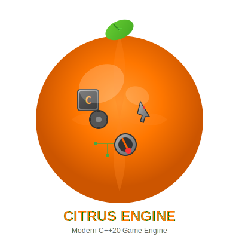

Citrus Engine Documentation
============================

**Fresh, Zesty Game Engine for Modern C++**

Citrus Engine is a modern C++20 game engine featuring ECS architecture, 
cross-platform support, and a focus on clean, maintainable code.

.. toctree::
   :maxdepth: 2
   :caption: Getting Started

   getting-started/index

.. toctree::
   :maxdepth: 2
   :caption: User Guides

   guides/index

.. toctree::
   :maxdepth: 2
   :caption: API Reference

   api/index

.. toctree::
   :maxdepth: 1
   :caption: Advanced Topics

   advanced/optimization
   advanced/platform-specific
   advanced/extending

Indices and tables
==================

* :ref:`genindex`
* :ref:`modindex`
* :ref:`search`
